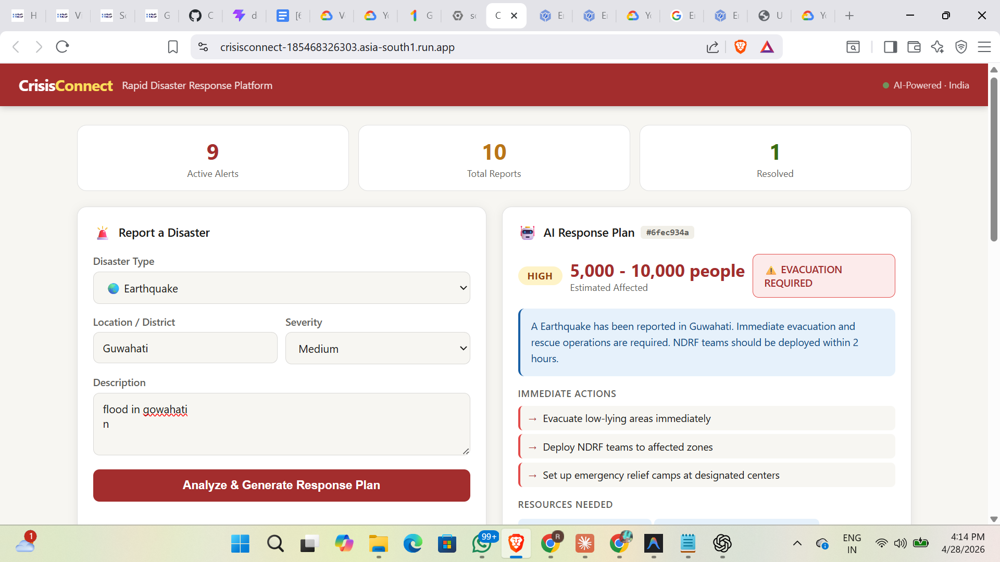
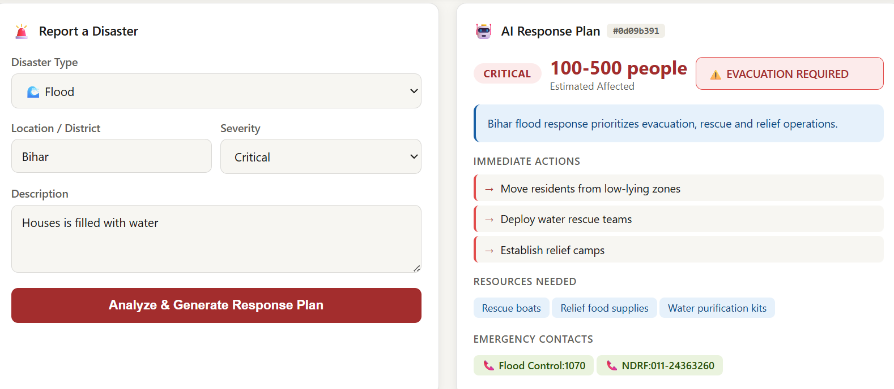

# CrisisConnect

## Problem Statement
Disaster response is often delayed due to fragmented communication, slow assessment, and poor coordination between responders and affected communities.

## Solution Overview
CrisisConnect is an AI-powered disaster response coordination platform that analyzes crisis reports, estimates severity, recommends resources, and supports emergency response decisions in real time.

## Features
- Disaster severity assessment  
- Resource recommendations  
- Dynamic emergency guidance  
- Alert dashboard  
- Cloud deployment on Google Cloud Run  
- Google AI / Gemini-ready logic  

## Tech Stack
- Python Flask  
- Google Cloud Run  
- Docker  
- HTML/CSS/JS  
- Google AI / Gemini

## Live Prototype
https://crisisconnect-185468326303.asia-south1.run.app/

## GitHub Repository
https://github.com/ramesh-codes/Crisis-Connect

## Run Locally
```bash
python app.py
```

## Prototype Screenshots

### Dashboard


### Crisis Analysis


## Impact
CrisisConnect helps:
- Improve emergency response coordination  
- Reduce disaster response delays  
- Support faster resource allocation  
- Provide AI-assisted decision support during crises
